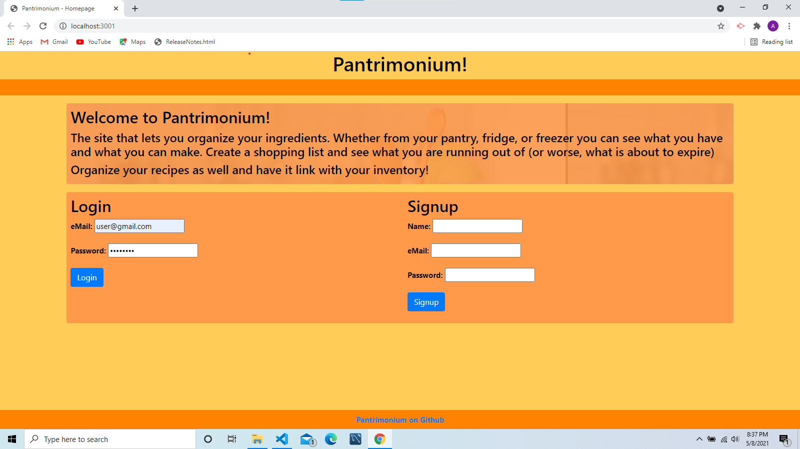
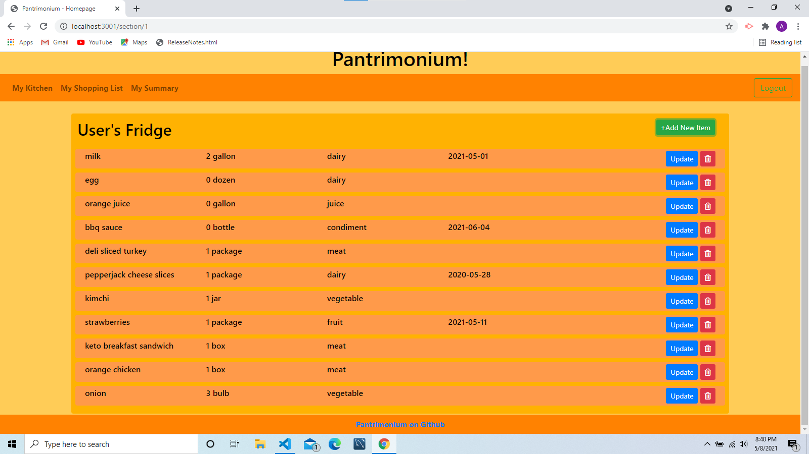
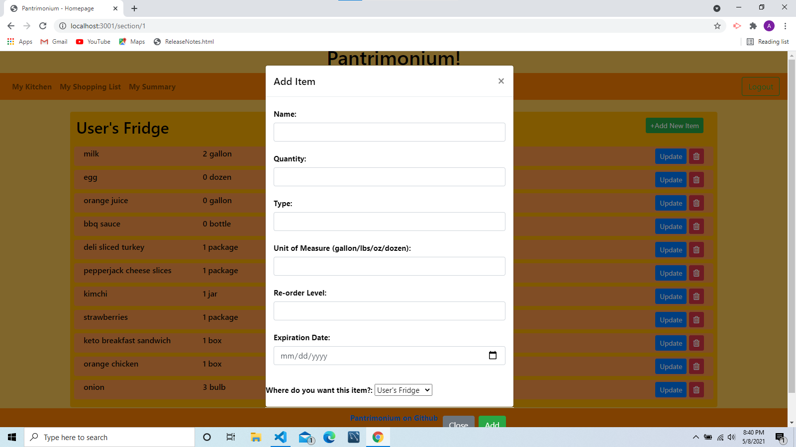
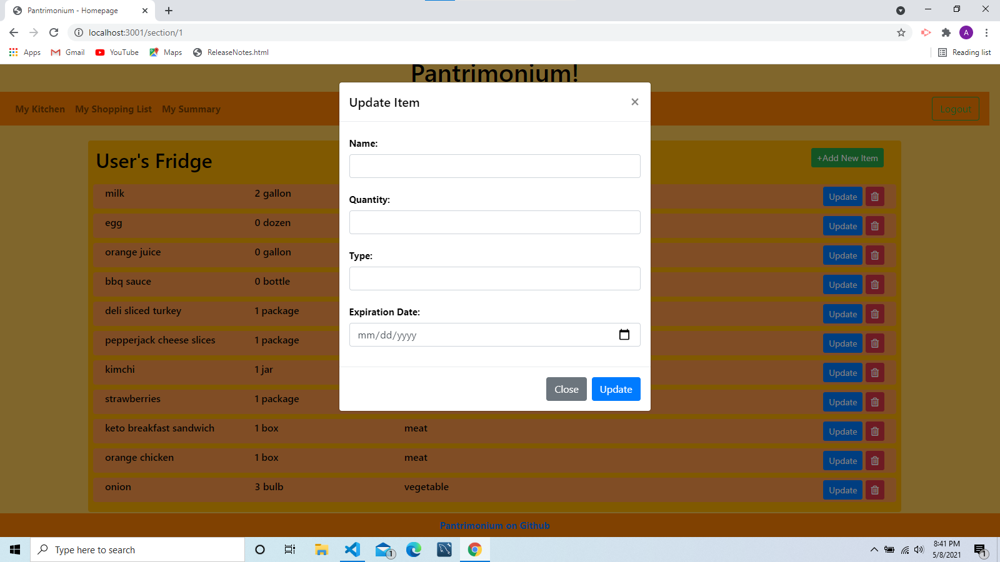
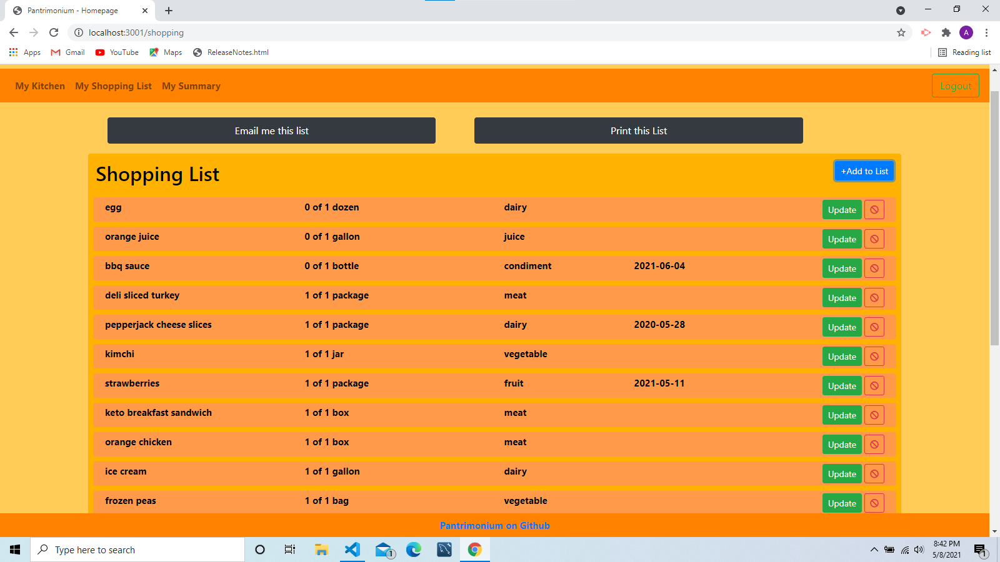

# Project 2 Name: Pantrymonium

## Description

- This app allows the user to create an inventory of all food items they have. In the app you can save, add, and create new food items. At the same time you can categorize each item and save them in a specific section, such as refrigerator or freezer. There is a generated shopping list where items running low or expiring are located and the user can also add, delete, or create new items to that page. 

## Table of Contents

- [Usage](#Usage)
- [Team](#Team)
- [License](#License)

## Usage

- The client will be able to sign up and create a user
    

- Once logged in the client will have access to 3 sections of inventory, in which they will be able to add new items and edit them as well. 
    

- You will be able to navigate from each page directly from your nav bar (My Kitchen, My Shopping List, and My Summary)
    

- The client will be able to go into each individual section and add new items as well as update them 
    
    

- When an item is running low or expiring the item will be added to the shopping list

- When you are in the shopping list page the client will have the option to email or print the shopping list

- Below those button options the shopping list will be provided with the option to delete or update any items, as well as adding new ones to the list
    

- My summary page will contain all your sections with items and total items of your entire inventory.

- There will be a log out button located on the top-right hand side for the client to be able to logout at any point

## Team

 - Robert Adams: [comatosino](https://github.com/comatosino)

 - Angelica Villar Cereceres: [angelicavc7](https://github.com/angelicavc7)

 - Rick Rocero: [rickrocero](https://github.com/rickrocero)

 - Sung Kim: [sungjk77](https://github.com/sungjk77)

## License
    
This project is covered under the [MIT](https://opensource.org/licenses/MIT) license.
    

